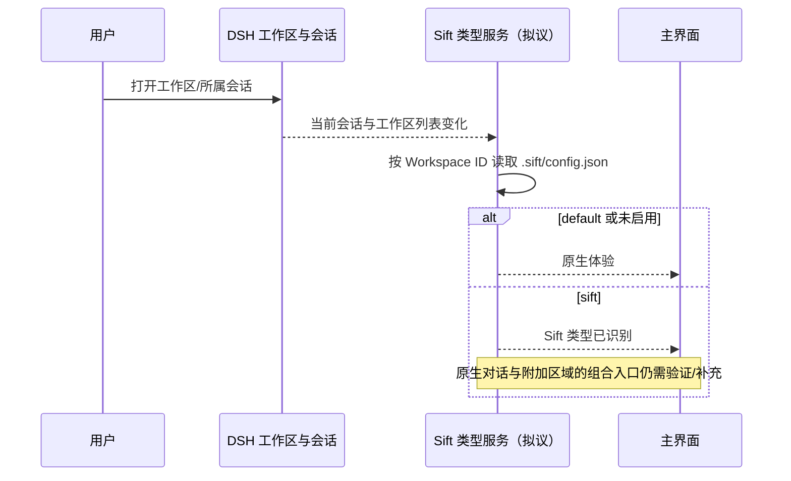

# DSH 0.1.5-rc.2：Workspace 类型可行性调查

> 历史调研：后续实现已经越过本文的最小实验阶段；本文只保留早期可行性判断和版本证据。

## 1. 概述

调查时间：2026-09-14。目标是判断能否让同一套 DSH 工作区支持 default 与 sift 两种工作方式：保持工作区、会话的原生管理，按工作区元信息显示不同主界面。

结论：**插件可以给工作区附加类型标识，并复用原生创建与导航；当前发行版没有原生 Workspace Profile，也没有已确认可直接组合完整原生对话的工作区布局扩展口。** 类型持久化与完整三栏体验必须分别验证，不能把一个 JSON 字段当成全部适配已经完成。

本调查使用本机安装的对应版本公开类型声明、发行包和 `@deepseek-ai/dsh-client-ui-slots@0.1.5-rc.2` 官方 README。GitHub 源码访问失败，因此结论限定到发行包；不代表主线最新能力。进行了 schema 和真实 SlotCore 实验，未进行浏览器端到端验证。未修改 Sift 业务代码或 DSH 安装文件。

## 2. 架构

DSH 通过 Cordis 插件提供服务。Host 的 `workspaceRegistry` 在 `storage.domain` 中保存工作区记录；`workspace-controller` 将其转为 Client 可订阅列表。`ui-workspace` 把工作区选择转换成会话选择；`ui-layout` 根据当前面板渲染 `main`；`ui-conversation` 注册默认对话入口并拥有它的子插槽。

建议的类型元信息归 Sift 插件所有，原生 Workspace 身份仍归 DSH。无需为了这个实验引入通用 Profile 注册框架。

## 3. 关键组件与证据

下列路径相对于本机 DSH 安装目录下的 `node_modules/@deepseek-ai/`，均检查了对应包的版本为 `0.1.5-rc.2`。

| 组件 | 文件 | 事实 |
| --- | --- | --- |
| Workspace 领域 | `dsh-workspace/lib/types/types.d.ts`、`spec.d.ts`、`index.d.ts` | 只有路径、标题、时间和会话关系，无 type/profile/metadata；create 对同一规范化路径复用记录 |
| Client 工作区 | `dsh-api-workspace-controller/lib/types/types.d.ts`、`client/model.d.ts`、`client/service.d.ts` | create 只接收 path；列表提供 getSnapshot/subscribe；传输投影无类型字段 |
| 工作区导航 | `dsh-client-ui-workspace/lib/types/client/navigation.d.ts`、`lib/client.js:44` | connectWorkspace 复用空会话或创建会话，openWorkspace 最终打开该会话 |
| 当前会话 | `dsh-api-session-controller/lib/types/client/sessions/service.d.ts` | current 在会话列表中，当前工作区可由工作区 sessionIds 反查 |
| 主布局 | `dsh-client-ui-layout/lib/types/client/service.d.ts`、`lib/client.js:115` | activePanelId 为 null 时选 main/conversation；selectPanel 支持其他已注册键 |
| 原生对话 | `dsh-client-ui-conversation/lib/client.js:16823` | main/conversation 声明 main.conversation，完整对话注册在其下 |
| 渲染授权 | `dsh-client-ui-renderer/lib/types/client/registry.d.ts`、`lib/client.js:280` | ctx.slots.renderSlot 仅允许 root；组件只能渲染自身声明的 children |
| 插槽核心 | `dsh-client-ui-slots` 官方 README 与 `lib/index.js:100` | 子插槽只能声明一次；不同优先级覆盖不继承原条目的 children |
| 新增工作区入口 | `dsh-client-ui-workspace/lib/types/client/contract/slots.d.ts` | 有目录选择流程插槽；未发现专门用于追加“添加 Sift 工作区”菜单项的公开插槽 |

## 4. 数据与控制流

### 原生路径

1. 选择目录，调用 `workspaces.create({ path })`。
2. Host 规范化已有目录；同路径返回已有 Workspace。
3. Client 收到 WorkspaceView，更新可订阅列表。
4. `uiWorkspace.openWorkspace(id)` 连接一个可复用或新建的空会话。
5. `openSession` 调用 `sessions.open(id)`，随后 `layout.selectPanel(null)`，回到原生对话。

这里没有可直接使用的独立 `currentWorkspace` 选择源。工作区列表就绪后，可结合 `sessions.list.current` 和 `workspace.sessionIds` 推导当前归属；无会话、列表未就绪、无归属时要有明确默认状态。

### 建议的插件路径（尚未实现）

1. Sift 复用原生目录选择与 `workspaces.create`，取得 Workspace ID 和规范化路径。
2. 由 Sift Host 在该工作区写入 `.sift/config.json`；已有配置先校验，不覆盖未知格式。
3. 通过 Sift 自己的接口向 Client 返回该工作区的类型标识。
4. Client 监听会话与工作区列表变化，读取对应类型；加载完成前不沿用上一工作区的类型。
5. 缺少配置使用 default，配置合法且为 sift 时启用 Sift 体验。损坏或不支持的配置提示错误并使用默认界面，不能悄悄重写。

元信息写入需要 Sift Host 的小接口；现有 `workspaceFiles` API 是只读预览/列表/观察能力，不能假设它已有任意文件写入方法。插件为自身配置进行读写不等于另建文件管理器。

## 5. 关键函数与方法

| 方法 | 用途及约束 |
| --- | --- |
| `workspaceRegistry.create(path, title?)` | Host 创建或复用；目录必须存在且为绝对路径 |
| `workspaces.create({ path })` | Client 复用原生 Workspace 创建，不接受 profile |
| `workspaces.list.getSnapshot()/subscribe()` | 工作区状态读取与更新通知 |
| `sessions.list.getSnapshot()/subscribe()` | 当前会话和会话列表变化 |
| `uiWorkspace.openWorkspace(id)` | 使用现有会话导航，带异步导航取消语义 |
| `layout.selectPanel(id)` | 切换已注册主面板，不改变会话；null 表示原生对话 |
| `slots.register({ name: 'main', key: 'sift' }, component)` | 可注册独立主面板，但未因此取得原生对话的渲染授权 |

## 6. 配置与实验环境

建议元信息（仅为待验证设计，不是 DSH 官方配置）：

```json
{
  "schemaVersion": 1,
  "profile": "sift"
}
```

| 项目 | 值或意义 |
| --- | --- |
| DSH | 本机安装 `0.1.5-rc.2` |
| 类型文件 | `<workspace>/.sift/config.json`，Sift 私有格式 |
| default | 没有启用 Sift 的元信息，保留原生体验 |
| Sift 开发环境 | 仓库现有 `.debug/development`，不使用正式 Home |
| 临时实验 | `.debug/workspace-profile-research/probe.mjs` 与 `probe-results.json` |

实验使用真实 `workspaceRecord` 和真实 `SlotCore`，以最小注册关系模拟宿主的 main/对话层级：

| 实验 | 结果 |
| --- | --- |
| 原生工作区 schema 解析带 profile 的记录 | profile 被剔除，不能直接扩展已有持久化格式 |
| 增加并卸载 main/sift | 成功，原入口保留 |
| main/sift 再声明 main.conversation | 抛出 already declared 错误 |
| 更高优先级覆盖 main/conversation | 可覆盖，但新条目没有继承 children；卸载恢复原条目 |

这些实验确认接口边界，不等于完整 Sift 界面已运行。

## 7. 注意事项

- **同路径只有一个原生工作区记录。** 给已存在目录启用 Sift 应是更新其插件配置，不应尝试创建第二个同路径工作区。
- **当前工作区通过会话关系推导。** 点开分组、最近使用工作区、当前会话所属工作区不是同一个概念；异步读取必须按工作区 ID 校验结果，防止快速切换串状态。
- **原生导航会恢复默认主面板。** 仅在创建时调用一次 selectPanel('sift') 不足以保持后续体验；也不能用监听器不停抢回 Sift，妨碍用户访问其他面板。
- **类型标识不会自动改变布局。** 元信息、创建入口、界面组合是三个独立接入点。
- **覆盖不是包装。** Shadow 一个 slot 不会自动把原组件或其渲染授权传进来；也不能从任意新面板直接调用 main.conversation。
- **工作区目录可搬迁不代表会话可搬迁。** 配置随目录移动，但原生 Workspace ID、会话记录和绝对外部引用需另行处理。
- 这里的 `profile` 是拟议的工作区体验标识，不是 DSH CLI 中 `--profile web` 的插件组合配置。

## 8. 扩展点与下一步

### 可以先验证的部分

做一个范围受控的类型实验：两个测试工作区，一个 default，一个 sift；用插件自己的元信息接口保存、读取类型，并在现有占位位置显示“当前工作区 + 类型”。验证重启恢复、往返切换、配置缺失、配置损坏与卸载后的默认体验。此阶段不引入素材、笔记或新业务组织模型。

### 完整界面需要解决的缺口

现有公开接口能新增主面板，但未找到直接将完整原生对话作为子区域嵌入该面板的受支持路径。新建按钮也不能仅凭“有目录选择 API”就断言可以直接追加到原生菜单。

若继续要求“同一个主区域内的素材、产出、原生对话”，建议优先研究一个最小宿主组合扩展：由拥有原生对话渲染授权的入口提供可包装区域，将原生对话 React 节点传给插件；默认或插件卸载时直接显示原节点。插件只负责选择布局和附加区域，不接管会话、模型和消息组件。具体插槽名称与契约尚未设计或实现。

这比改 Workspace 的数据库 schema 更贴近当前缺口。不能据此次调查断言完全不改 DSH 即可完成三栏体验，也不应据此放弃 Workspace 类型方向。

## 9. 可视化流程


